# Airlines Database Management System

## Group Name: BooraKSaiduH

### Team Members: Hephzibah Saidu, Boora Kaushik

## Overview

The Airlines Database Management System is designed to efficiently manage airline operations, including flight scheduling, passenger bookings, and staff management. This README provides instructions for setting up and running the system.

## Technical Specifications

- **Database Type:** SQL (MySQL)
- **Backend:** Python Flask for API endpoints
- **Frontend:** React Pages
- **Database Connection:** SQL Connector
- **Dependencies:** PrettyTable, PyMySQL

## Installation

1.  **Download the Project:**

    - Clone or download the project zip file to the local directory form the GitHub rpository links provided below.
    - BACKEND: [BooraKSaiduH Backend Repo](https://github.com/shephzibah/dbms_backend)
    - FRONTEND: [BooraKSaiduH Frontend Repo](https://github.com/BooraKaushik/dbms_frontend)

2.  **Install MySQL:**

    - Download and install MySQL on your system.

3.  **Extract Files:**

    - Extract the downloaded project zip file.

4.  **Install Backend Dependencies:**
    - Open the terminal, and move into backend directory and run the following commands:
      ```
      pip install prettytable
      pip install pymysql
      ```
5.  **Install Frontend Dependencies:**

    - Open the terminal, move into frontend directory and run the following command:
      ```
      npm install
      ```
      make sure you have node.js installed on your system.

6.  **Database Setup:**

    - Run the SQL files (`project.sql`) in MySQL Workbench or terminal to create the database, procedures, triggers, and insert data.

7.  **Run the Backend Application:**
    - Navigate to the project root directory in the terminal and move into backend directory.
    - Run the command:
      ```
      python3 project.py
      ```
8.  **Run the Frontend Application:**
    - Navigate to the project root directory in the terminal and move into frontend directory.
    - Run the command:
      ```
      npm start
      ```

## System Usage

### Passenger Functionalities:

- **Registration:**

  - New passengers can register by providing necessary details.

- **Login:**

  - Existing passengers can log in using their email and password.

- **Booking a Ticket:**

  - Passengers can view available flights, choose a route, and book a ticket.

- **Viewing and Updating Bookings:**
  - Passengers can view their booking history, update details, and reschedule/cancel bookings.

### Staff Functionalities:

- **Login:**

  - Staff members log in using their credentials.

- **Viewing and Managing Bookings:**

  - Staff can view all bookings of passengers, search for a passenger, and find passengers on a particular flight.

- **Managing Schedules:**

  - Staff can create, update, or delete flight schedules.

- **Extended Future Work:**
  - The system has potential for extension, including staff, airline, and aircraft management, as well as dynamic updates to schedules.

## Lessons Learned

- **User-Centric Design:**

  - Prioritize user experience for efficient system interaction.

- **Backend Priority:**

  - Allocate sufficient time for backend tasks for data consistency and functionality.

- **Technical Expertise Gain:**
  - Gain experience in Python, MySQL, React, Frontend and backend development.

## Future Work

- **Extended Staff Functionality:**
  - Enhance staff capabilities for managing airlines, aircraft, and related entities.
- **Airlines and Aircraft Management:**
  - Incorporate comprehensive management of airlines and aircraft.
- **Dynamic Flight Schedule Updates:**
  - Implement real-time updates for flight schedules.
- **Advanced Passenger Options:**
  - Provide passengers with more booking options.
- **Automated Seat Allocation:**
  - Integrate an automated seat allocation system.
- **Real-Time Analytics:**
  - Implement real-time analytics for data-driven decisions.
- **Enhanced Security Measures:**
  - Strengthen security for sensitive data.

## Sample Run

- **LOGIN:**
  - Login with Invalid credentials,
    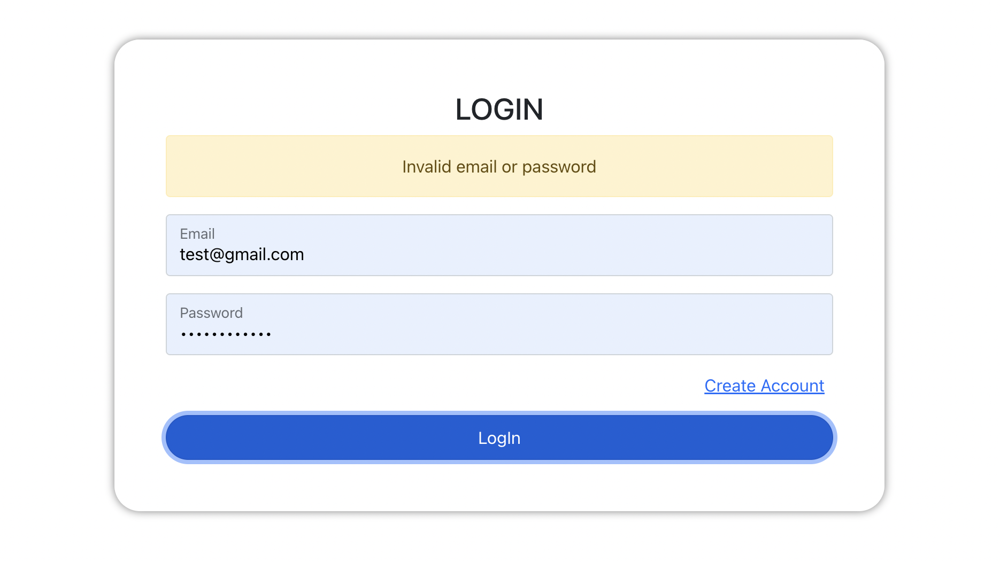
  - Login with Valid credentials,
    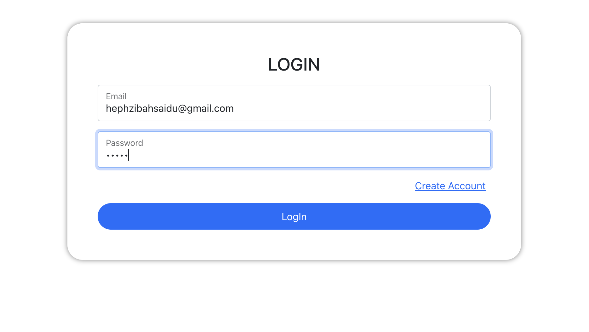
- **Logged in as a Passenger:**
  - **Initial Booking Page:**
    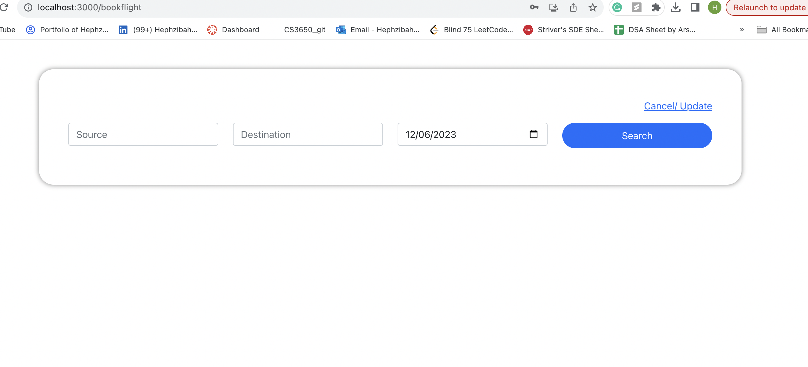
  - **Flight Search:**
    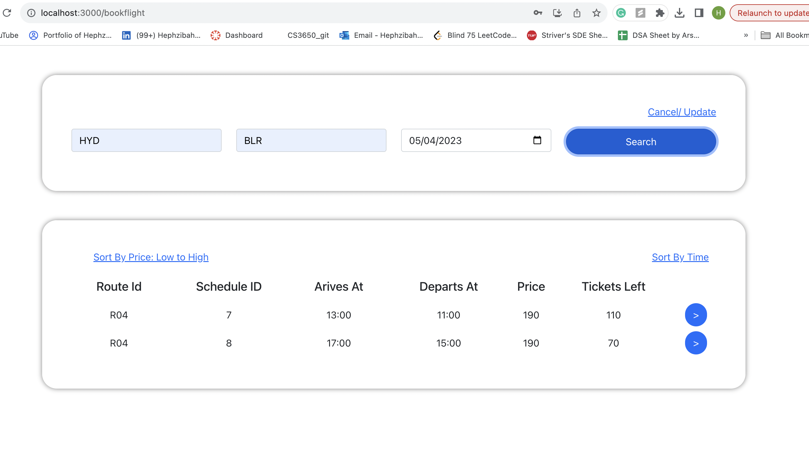
  - **Booking Details Confirmation Page:**
    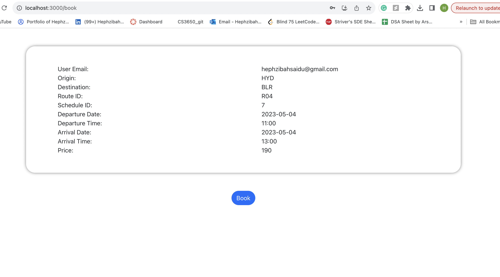
  - **Booking Confirmation Page:**
    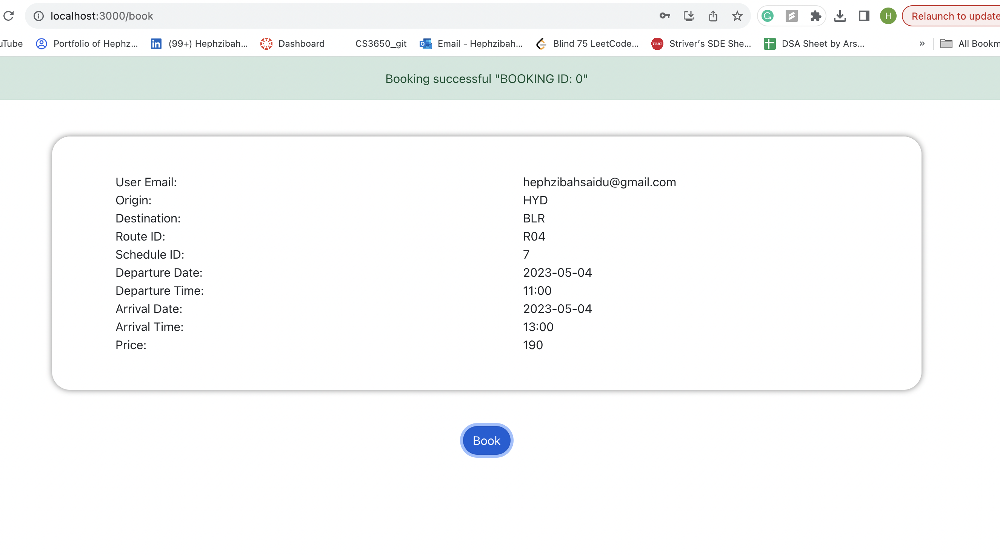
  - **Initial screen for Reschedule or Cancel:**
    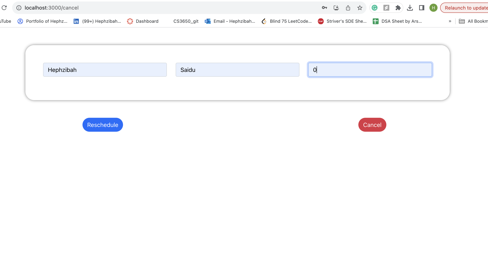
  - **Cancel Booking Page:**
    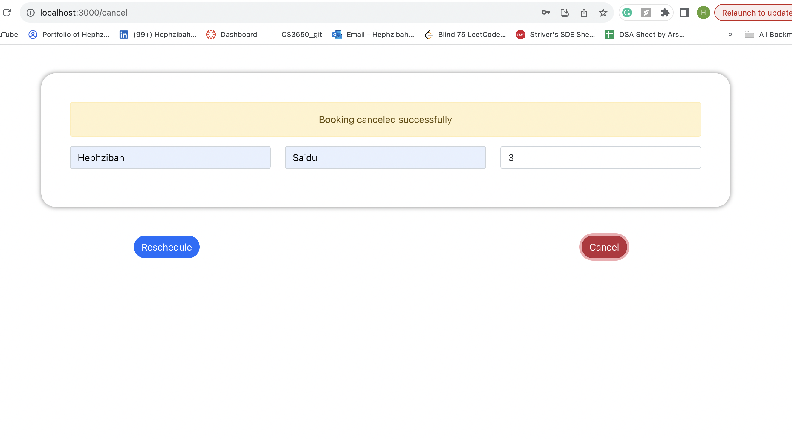
  - **Reschedule Booking Page:**
    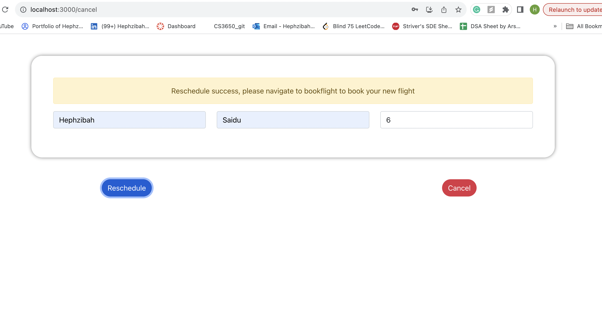
- **Logged in as a Staff member:**

  - **Logging in as Staff member:**
    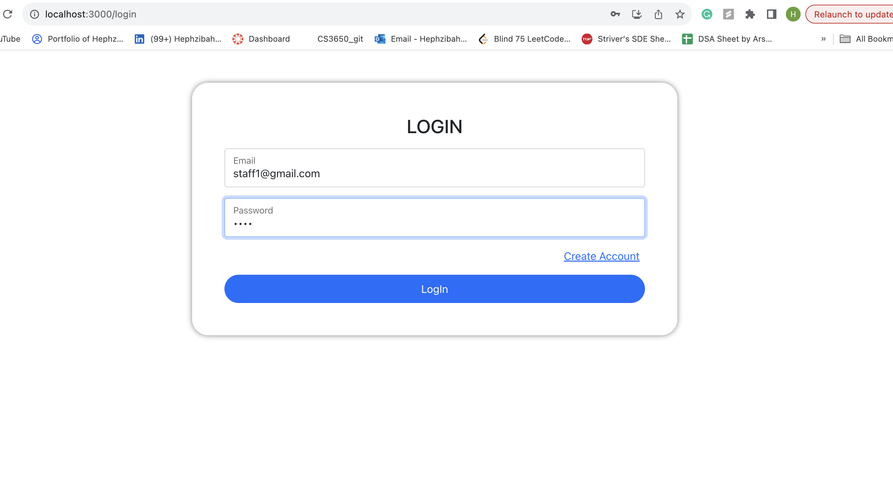
  - **Schedules Screen:**
    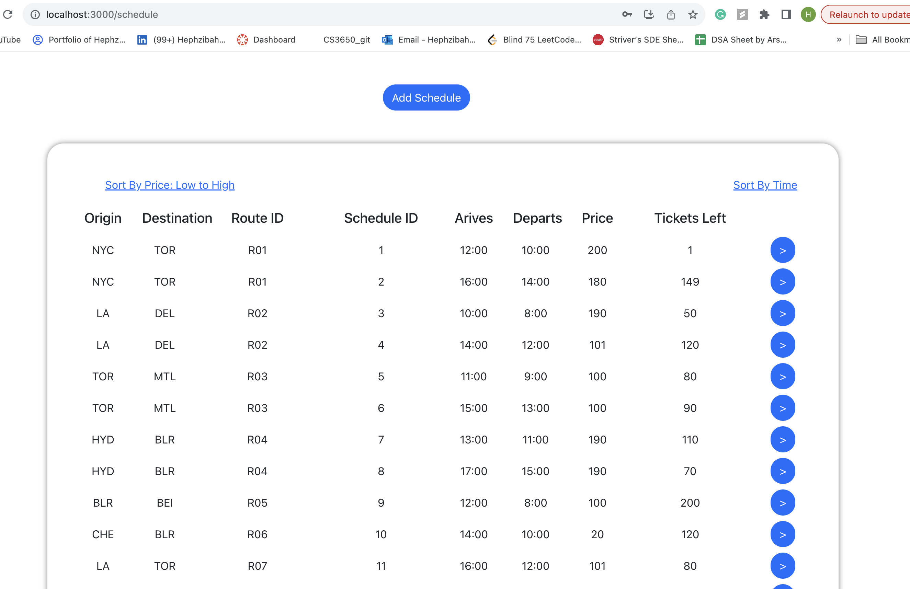
  - **Add Schedule Screen:**
    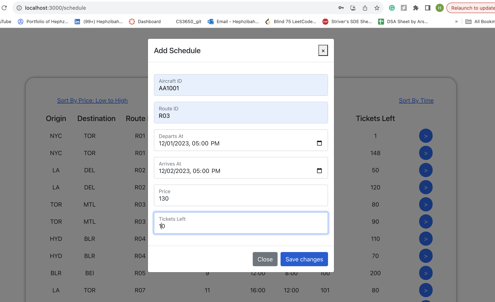
  - **Add Schedule Confirmation Screen:**
    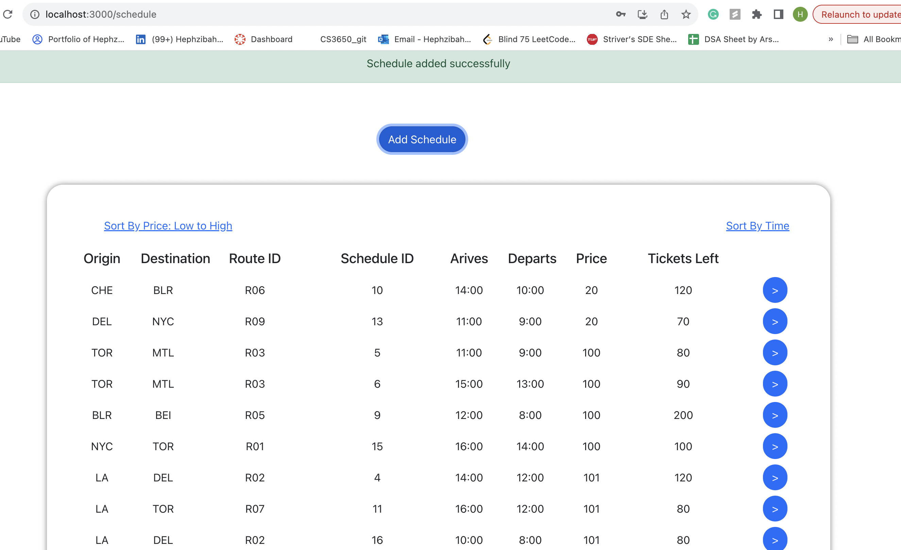
  - **Edit/Cancel Schedule Initial Screen:**
    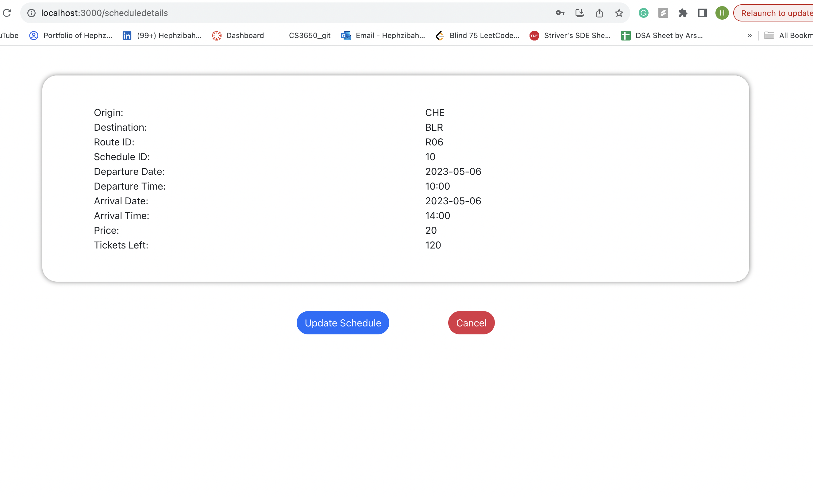
  - **Edit Schedule Screen:**
    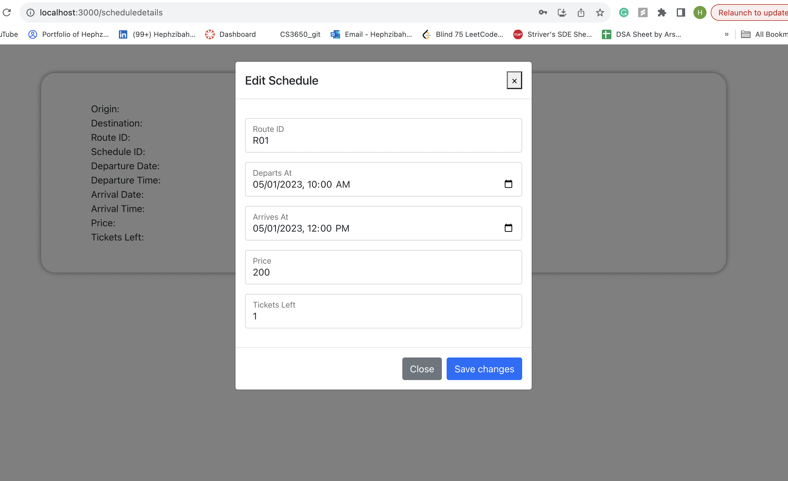
  - **Edit Schedule Confirmation Screen:**
    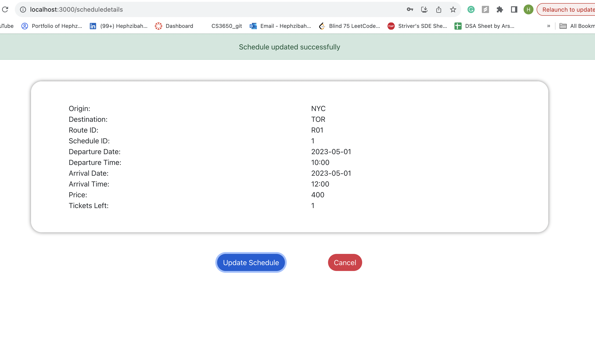
  - **Cancel Schedule Screen:**
    

- **Registration Screen:**
  - **Valid details entered:**
    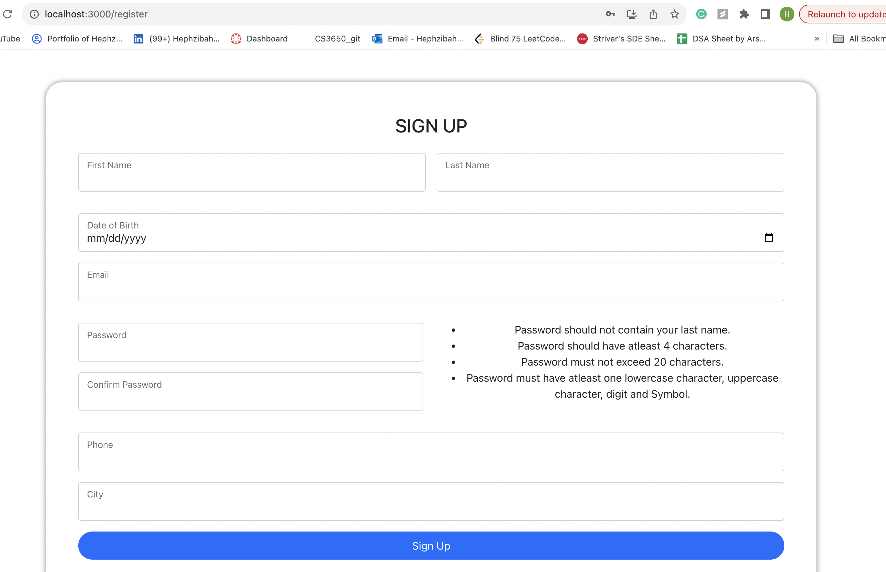
  - **Registration Screen with validation errors:**
    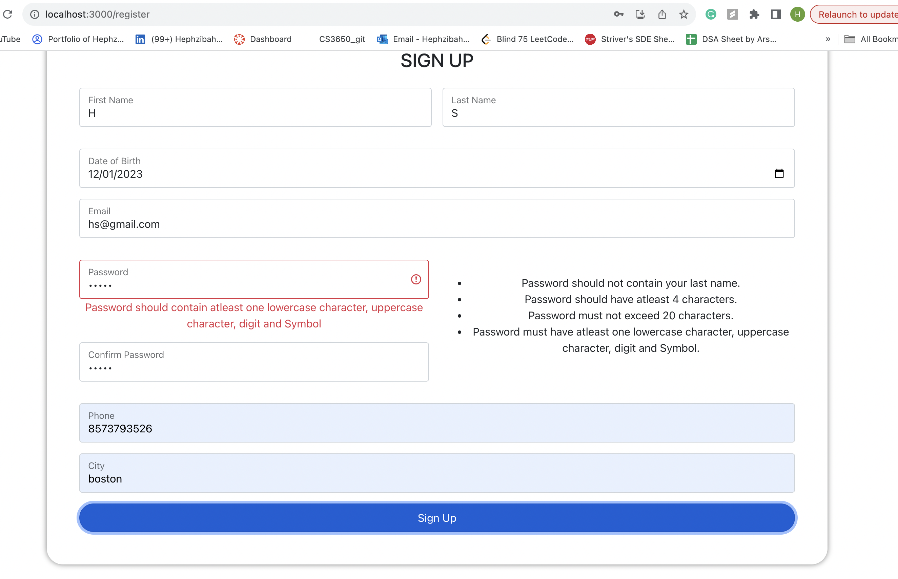

**Note:** Detailed instructions, screenshots, and sample runs can be added for better clarity.
